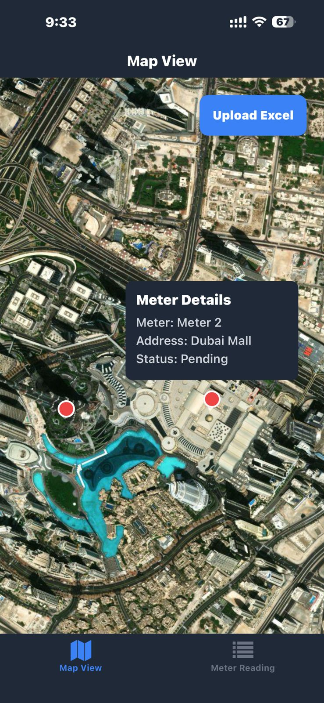
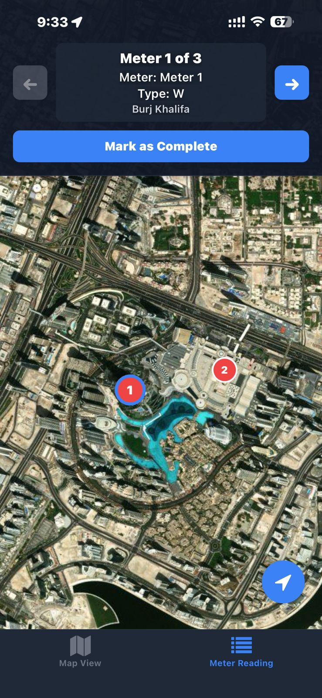
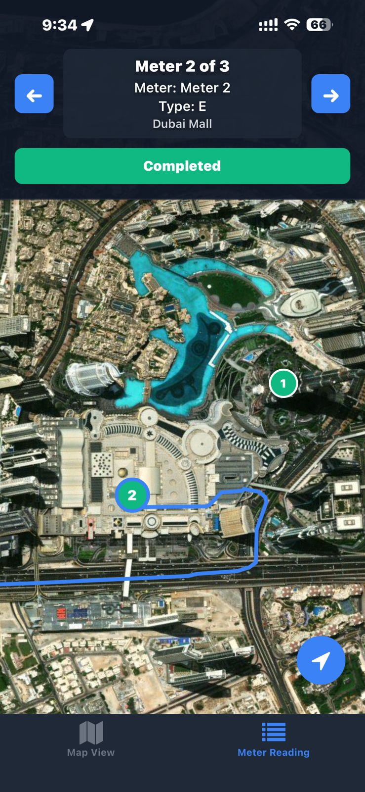

# Metermap

A React Native mobile application for utility meter reading route optimization and navigation. Built with Expo, this app helps field technicians efficiently navigate to meter locations by uploading Excel spreadsheets containing meter data and generating optimized routes.

## Screenshots

<p align="center">
  
  
  
</p>

## Demo

<p align="center">
  
</p>

*The demo shows the complete meter reading workflow: navigating to a meter location, viewing meter details, and marking it as completed.*

## Features

- **Excel Import**: Upload Excel files containing meter locations with coordinates (UTM format supported)
- **Route Optimization**: Automatically calculates the most efficient route through all meter locations using clustering and nearest-neighbor algorithms
- **Real-time Location Tracking**: Live GPS tracking with route visualization on satellite maps
- **Satellite Map View**: High-detail satellite imagery for easy location identification
- **Progress Tracking**: Mark meters as completed and track overall progress
- **Missing Coordinates Handling**: Manually add coordinates for meters missing location data via direct input or MyLand URL
- **Grouped Locations**: Multiple meters at the same address are grouped for efficient visits

## Future Improvements

- Turn-by-turn voice navigation for hands-free field work
- Firebase Firestore integration for data persistence across sessions and devices
- Firebase-based meter location correction for misclassified coordinates
- Offline mode with local caching for areas with poor connectivity
- Photo capture for meter readings with automatic OCR

## Tech Stack

- **Framework**: React Native with Expo
- **Navigation**: React Navigation (Bottom Tabs)
- **Maps**: React Native Maps with satellite view
- **Routing**: OpenRouteService API for driving directions
- **Coordinate Conversion**: Proj4 for UTM to lat/long conversion
- **File Handling**: Expo Document Picker + XLSX parser
- **Location**: Expo Location with background tracking support

## Prerequisites

- Node.js (v16 or higher)
- npm or yarn
- Expo CLI
- Android Studio (for Android development)
- Xcode (for iOS development, macOS only)

## Installation

1. Clone the repository:
```bash
git clone https://github.com/sayedmowafi/Metermap.git
cd Metermap
```

2. Install dependencies:
```bash
npm install
```

3. Create a `.env` file in the root directory with your API keys (see `.env.example` for reference):
```env
MAPBOX_ACCESS_TOKEN=your_mapbox_access_token
OPENROUTE_API_KEY=your_openroute_api_key

# Optional - Firebase integration planned for future release
# FIREBASE_API_KEY=your_firebase_api_key
# FIREBASE_AUTH_DOMAIN=your_project.firebaseapp.com
# FIREBASE_PROJECT_ID=your_project_id
# FIREBASE_STORAGE_BUCKET=your_project.firebasestorage.app
# FIREBASE_MESSAGING_SENDER_ID=your_sender_id
# FIREBASE_APP_ID=your_app_id
```

4. Start the development server:
```bash
npm start
```

5. Run on your device or emulator:
- Press `a` for Android
- Press `i` for iOS
- Scan QR code with Expo Go app

## Excel File Format

The app expects Excel files with the following columns:
- `X` - UTM X coordinate (Easting)
- `Y` - UTM Y coordinate (Northing)
- `رقم اللاصق` - Meter sticker number
- `عنوان القسيمه` - Plot address
- `الخدمة` - Service type (E for Electricity, W for Water, etc.)

A sample Excel file is included in the repository: [`samples/sample-data.xlsx`](samples/sample-data.xlsx)

## API Keys Required

1. **Mapbox**: Get an access token at [Mapbox](https://www.mapbox.com/) - Required for map rendering
2. **OpenRouteService**: Get a free API key at [OpenRouteService](https://openrouteservice.org/) - Required for route optimization

**Coming Soon (not required yet):**
- **Firebase**: Will be used for data persistence and meter location corrections in a future update

## Building for Production

### Android
```bash
eas build --platform android
```

### iOS
```bash
eas build --platform ios
```

## Project Structure

```
Metermap/
├── app/
│   ├── screens/
│   │   ├── MapScreen.js      # Map view with marker display
│   │   └── MeterReading.js   # Main navigation screen
│   └── (tabs)/
│       └── _layout.js        # Tab navigation layout
├── src/
│   ├── context/
│   │   └── MarkerContext.js  # Global marker state
│   ├── services/
│   │   └── firebaseService.js # Firebase operations (future)
│   └── utils/
│       └── coordinateConverter.js # UTM to lat/long conversion
├── assets/                   # Images and fonts
├── app.config.js            # Expo configuration with env vars
└── package.json
```

## Contributing

1. Fork the repository
2. Create your feature branch (`git checkout -b feature/AmazingFeature`)
3. Commit your changes (`git commit -m 'Add some AmazingFeature'`)
4. Push to the branch (`git push origin feature/AmazingFeature`)
5. Open a Pull Request

## License

This project is licensed under the MIT License.

## Author

**Sayed Mowafi** - [Portfolio](https://sayedmowafi.dev) | [GitHub](https://github.com/sayedmowafi)

## Acknowledgments

- [Expo](https://expo.dev/) for the amazing React Native framework
- [OpenRouteService](https://openrouteservice.org/) for routing API
- [Proj4js](http://proj4js.org/) for coordinate transformations
